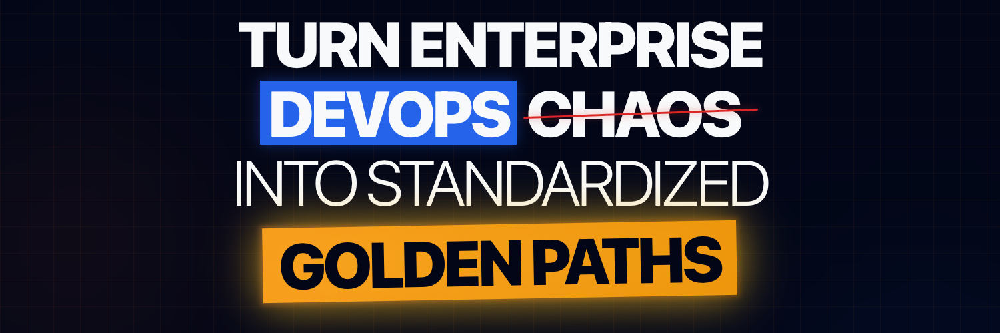

<!-- WayneGoosen/WayneGoosen — GitHub Profile README -->

# Howzit, I'm [Wayne](https://www.linkedin.com/in/waynegoosen/)!

A platform engineer with over a decade in the industry — started out in development building full-stack web apps and large-scale transaction backend systems, and that dev background is what drives me to build platforms that developers actually enjoy using.

These days I lead an Internal Developer Platform that lets engineers ship applications in minutes instead of days. Azure, AKS, Terraform, ArgoCD, shared Helm charts, Azure Pipeline templates — the golden paths that mean developers don't need a PhD in YAML and a three-day approval process to get code to production.

I write about what I learn at [waynegoosen.com](https://waynegoosen.com) and take on consulting for teams making that same jump.

🇿🇦 South African · 📍 Switzerland · ⏰ CET/CEST · 🌍 Remote worldwide

## Tech Stack

## Latest Blog Posts

<!-- BLOG-POST-LIST:START -->
- [From Docker Compose to Score: A Platform Engineering Guide](https://waynegoosen.com/post/platform-engineering-transition-docker-compose-to-score-specification/)
- [Streamlit Deployment Guide Part 4: GitHub Workflow for Terraform Apply & Destroy](https://waynegoosen.com/post/streamlit-deployment-guide-part-4-github-tf-workflow/)
- [How to Pass Azure Pipeline Parameters and Variables to Terraform](https://waynegoosen.com/post/add-boolean-vars-terraform-azure-devops/)
- [Streamlit Deployment Guide Part 3: Azure Infrastructure via Terraform](https://waynegoosen.com/post/streamlit-deployment-guide-part-3-azure-infra/)
- [Streamlit Deployment Guide Part 2: GitHub Workflow to Build/Publish to ghcr.io](https://waynegoosen.com/post/streamlit-deployment-guide-part-2-github-workflow/)
<!-- BLOG-POST-LIST:END -->

[Read all posts →](https://waynegoosen.com/blog)

## GitHub Stats

---

*Available for consulting — platform audits, golden path architecture, AKS/ArgoCD implementations.*
*[Get in touch](https://waynegoosen.com/#contact) · [wayne@waynegoosen.com](mailto:wayne@waynegoosen.com)*
